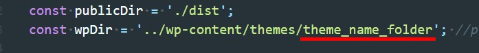

# Markup and Wordpres, PUG and HTML

*** Перед началом работы над проектом необходимо сделать такие действия: ***

* определиться с видом проекта WP or Markup
* будете использовать PUG or HTML

Настройки проекта делаются в файле gulp-settings.js

## По умолчанию установлены настройки так что сборка компилит код для стандартного маркап проекта.

По умолчанию установлен препроцессор PUG.

## Настройка сборки под WP

* Меняем значение <isWP: false> на <isWP: true>
* Прописываем правильное название темы в файле gulp-settings.js

    

* В файле <style.scss> разкоменчиваем строки
    + // @import 'base-wp/head-wp';
    + // @import 'base-wp/cms-reset';
    + // @import 'base-wp/wp-reset';

===

## Щоб коменти переносилист в фінальний css траба в коменті писати так 

</*! ... */>
