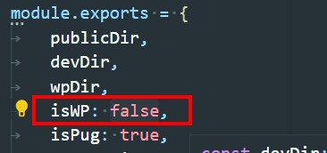
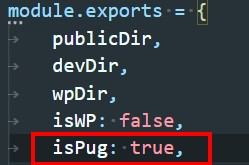
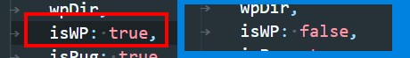

# Markup and Wordpres, PUG and HTML

# Начало разработки

Чтобы начать разработку, надо сделать клон в папку проекта используя команду

```
git clone git@github.com:Yura-Panchenko/Gulp-dev-new.git
```

### Перед началом работы над проектом необходимо сделать такие действия:

* определиться с видом проекта WP or Markup
* будете использовать PUG or HTML

Настройки проекта делаются в файле gulp-settings.js

## По умолчанию установлены настройки так что сборка компилит код для стандартного маркап проекта.



По умолчанию установлен препроцессор PUG.



## Настройка сборки под WP

* Меняем значение < isWP: false > на < isWP: true >

    

* Прописываем правильное название темы в файле gulp-settings.js

    

* В файле <style.scss> разкоменчиваем строки
    + // @import 'base-wp/head-wp';
    + // @import 'base-wp/cms-reset';
    + // @import 'base-wp/wp-reset';

### Чтобы коментарии сохранялись в финальном коде, ставим восклицательный знак вначале коментария

```
/*!
    block comments
*/
```

## Преходим внутрь папки где лежат gulp файлы

## Устанавливаем сборщик

для запуска нашего проекта надо установить наши модули

```
$ npm install
```
## Запускаем проект в разработку

Для старта нашего проекта запускаем команду - $ gulp

```
$ gulp
```

## Продолжение проекта

для последующей работы мы запускаем только команду

```
$ gulp
```

## Перед постановкой на QA или перед отправкой клиенту нам надо почистить код и ужать картинки, для этого запускаем команду

```
$ gulp dist
```

## Как работать с папками и файлами?

* Всю разработку проводим в папке src !!!
* в папку assets вкладываем (все то что не требует компиляции)
    - картинки
    - шрифты
* в папку js складываем js
* в папку views складываем pug or html в зависимости от того на чем идет разработка:
    - темплейты
    - mixins
    - head
    - header
    - footer
    - и тд
* в папку styles соответственно scss
* файлы которые не учавствуют в разработке - удаляем
